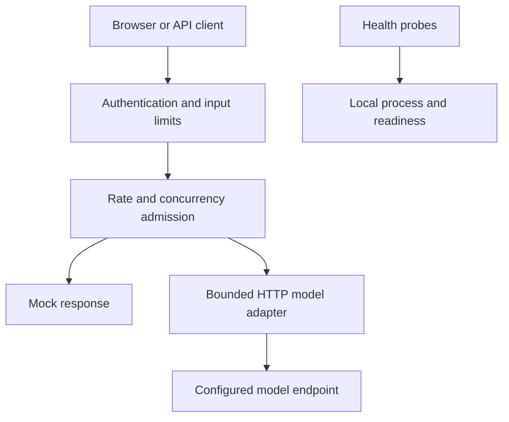

# AI Deployment Recipes

### Find your workload. Run a recipe. Understand the deployment.

Practical, runnable examples for deploying **AI applications, agent workloads, and models**.

**Created and maintained by Nimesha Jinarajadasa.**

We are starting with one small, inspectable application. More recipes are coming, with each addition documenting its architecture, failure behavior, verification results, and deployment trade-offs. Planned recipes are not implemented features.

## Why this exists

This is a teaching reference, not a product or a chatbot. Most AI examples show you how to *call a model*; this one shows the part that is actually hard to get right — authentication, request limits, timeouts, container hardening, redacted logs, and pinned dependencies. The model is intentionally faked (mock mode) so nothing distracts from that deployment machinery.

The goal is to make deployment **decisions** visible and runnable:

- **Learn the plumbing, not the prompt.** The tiny app is a vehicle; the safeguards around it are the lesson. You can [see each one act](docs/see-the-safeguards.md).
- **Every choice is inspectable and bounded.** [Deployment decisions](docs/deployment-decisions.md) pairs each decision with its reason and its "next step" for real use, and the [verification record](docs/verification.md) is explicit about what was *not* tested. This targets a single-instance learning deployment, not a production-ready guarantee.
- **A cookbook that grows by workload.** Applications first, then agent workloads, then model serving — each an independently runnable, tested recipe. See the [roadmap](ROADMAP.md).

In short: it turns "how do you actually deploy AI responsibly?" into something you can run, watch, question, and copy — starting from the smallest honest example.

## Start here

| Track | Recipe | Status |
|---|---|---|
| AI applications | [01 · Containerized text assistant](recipes/01-ai-app/README.md) | Implemented; application tests pass. Container execution and live-provider verification remain pending. |
| Agent workloads | Durable tasks, retries, and recovery | Planned |
| Model serving | GPU inference, capacity measurements, and overload handling | Planned |

Recipe 01 is a stateless, single-turn text assistant with a browser interface and API. It runs without a model API key in clearly labeled mock mode. An optional adapter calls a compatible, non-streaming Chat Completions endpoint.

## Run the first recipe

Prerequisites: **Python 3.12+** for setup and smoke scripts; **Docker Engine/Desktop with Docker Compose v2** for the application. Python application dependencies run inside the container.

From the repository root:

```bash
cd recipes/01-ai-app
python3 scripts/init_local.py
cp .env.example .env
# Build and start; wait until the container's liveness check passes.
docker compose up --build -d --wait
python3 scripts/smoke.py
```

Open **http://localhost:8000**. Read `.secrets/app_token` locally and paste it into the application-token field. The generated token is required for chat requests. Mock mode returns a fixed deployment-check response; it does not run an AI model.

On systems using `python` instead of `python3`, substitute that command. On PowerShell, use `Copy-Item .env.example .env` for the copy step. Review secret-file ACLs on Windows as explained in the recipe.

Stop with `docker compose down`. Local secret files remain for subsequent runs. See [recipe instructions](recipes/01-ai-app/README.md) for live mode, Python-only development, and troubleshooting.

## Small scope, explicit decisions

The first recipe includes:

- Shared-token authentication for model requests.
- Request-body and message limits, a per-process request rate limit, and bounded model concurrency.
- Upstream phase timeouts plus an overall deadline; no hidden automatic retries.
- Bounded provider response bodies and sanitized error messages.
- Separate liveness and local-readiness endpoints.
- Request IDs and completion logs that omit prompts, answers, credentials, and URLs.
- A non-root container configuration, read-only root filesystem, dropped capabilities, and resource limits.
- Hash-pinned Python dependencies, automated application tests, and a GitHub Actions workflow with a container smoke-test job.

These are practical engineering controls, not a universal production-readiness guarantee. This version targets a **single-instance learning deployment or controlled internal prototype**. Public multi-user services need workload-specific identity, TLS, quotas, evaluation, observability, and operational design. See [deployment decisions](docs/deployment-decisions.md).

## Architecture



The configured model endpoint belongs to the operator. Users cannot supply a URL or choose a model through the chat request.

## Explore

- [Recipe 01: run, deploy, verify, and troubleshoot](recipes/01-ai-app/README.md)
- [See the safeguards yourself: watch each control act](docs/see-the-safeguards.md)
- [How the safeguards map to OWASP (LLM Top 10 & API Security)](docs/owasp-mapping.md)
- [Deployment decisions and public-service requirements](docs/deployment-decisions.md)
- [Verification record](docs/verification.md)
- [Roadmap](ROADMAP.md)
- [Contributing](CONTRIBUTING.md) · [Recipe template](recipes/TEMPLATE/README.md) · [Governance](GOVERNANCE.md) · [Code of Conduct](CODE_OF_CONDUCT.md)
- [Security](SECURITY.md)
- [License: MIT](LICENSE)

## Contribute a recipe

This is meant to grow into a **vendor-neutral, runnable cookbook** for deploying AI workloads — the gap between "I can deploy a model" and "I run it in production" (industry reports put the latter at a small fraction of the former).

Anyone can add a recipe, **including vendors publishing one for their own tool** — every recipe is held to the same standard: it must actually run, document its failure behavior and limitations honestly, include verification evidence, and carry no marketing. Start from the [recipe template](recipes/TEMPLATE/README.md); the [governance](GOVERNANCE.md) explains how recipes are reviewed and why neutrality is protected.

The goal is straightforward: small examples that make the deployment decisions visible, with enough evidence for other engineers to inspect and improve them.
