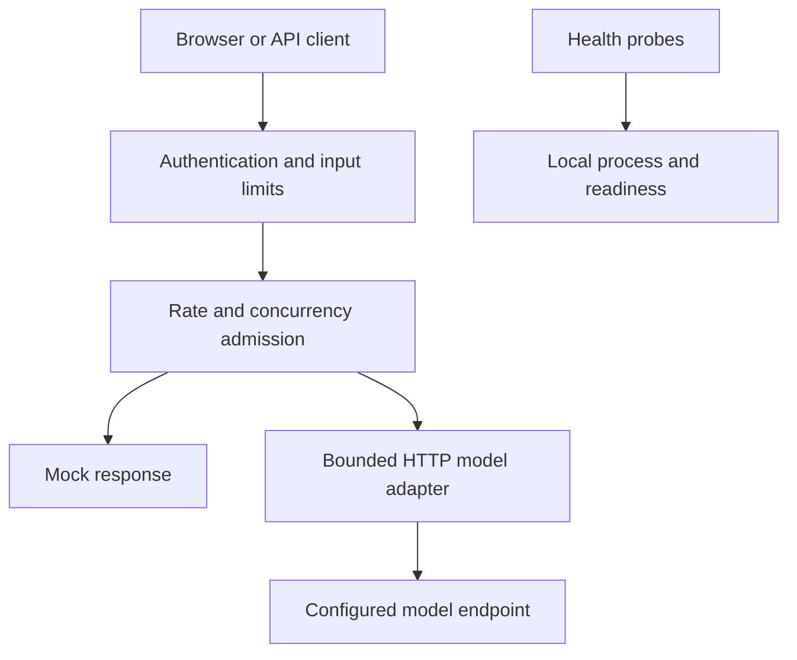

# AI Deployment Recipes

### Find your workload. Run a recipe. Understand the deployment.

**New here? This is for you too.** "Deploying" an AI app just means *actually running it as a real service people can use* — not only getting a model to reply once on your laptop, but putting it online so it stays up, can't be abused, and won't quietly run up a huge bill. That part is genuinely hard, and most tutorials skip it.

This project is a **cookbook for exactly that.** Each *recipe* is a small, real AI service you can **run yourself in a few minutes**, already set up the careful way — a password to get in, limits so no one can abuse it, timeouts, and a locked-down container — with plain-language notes on *why* each piece is there.

You don't need to be an expert, or even have an AI account. The first recipe runs with **no API key and no cost**: it replies with a fixed message so you can watch a real, safe deployment work before plugging in an actual model. If you can install Docker and copy a few commands, you're in.

> In one line: **a vendor-neutral, runnable cookbook for deploying AI workloads** — apps, agents, and model serving — with the safeguards built in and the trade-offs made explicit.

Maintained by Nimesha Jinarajadasa. Contributions — including vendor-authored recipes — are welcome; see [Contribute a recipe](#contribute-a-recipe).

## Recipes

| Workload | Recipe | Status |
|---|---|---|
| AI applications | [01 · Containerized text assistant](recipes/01-ai-app/README.md) | **Available.** App tests, container build/smoke, and non-root/read-only checks pass in CI. Live-provider run still pending. |
| Agent workloads | Durable tasks, retries, and recovery | Planned |
| Model serving | GPU inference, capacity, and overload handling | Planned |

See the [roadmap](ROADMAP.md) for what's next and how it's prioritized.

## Run recipe 01

Prerequisites: **Python 3.12+** (setup/smoke scripts) and **Docker with Compose v2**.

```bash
cd recipes/01-ai-app
python3 scripts/init_local.py
cp .env.example .env            # PowerShell: Copy-Item .env.example .env
docker compose up --build -d --wait
python3 scripts/smoke.py
```

Open **http://localhost:8000**, paste the token from `.secrets/app_token`, and send a message. In **mock mode** (the default) it returns a fixed response and calls no model — so it runs with no API key and no cost. Stop with `docker compose down`. Live mode, Python-only development, and troubleshooting are in the [recipe README](recipes/01-ai-app/README.md).

## What recipe 01 shows

Recipe 01 is a stateless, single-turn text assistant (browser UI + API) that demonstrates the deployment safeguards every recipe here is held to:

- shared-token authentication; request-body, message, rate, and concurrency limits
- upstream timeouts plus an overall deadline; no hidden retries; bounded provider responses
- separate liveness/readiness; request IDs; logs that omit prompts, answers, and secrets
- non-root, read-only container with dropped capabilities and resource limits
- hash-pinned dependencies, automated tests, and CI with a container smoke test

You can **[watch each safeguard fire yourself](docs/see-the-safeguards.md)** (or in the app's "Prove it yourself" panel), and see **[how they map to the OWASP LLM Top 10 & API Security](docs/owasp-mapping.md)**.

The scope is stated plainly: this targets a **single-instance learning deployment or internal prototype**, not a public multi-user service. [Deployment decisions](docs/deployment-decisions.md) pairs each choice with its boundary and next step; the [verification record](docs/verification.md) states exactly what was and wasn't tested.

<details>
<summary>Architecture</summary>



The model endpoint belongs to the operator; users cannot choose a URL or model through a request.
</details>

## Contribute a recipe

The cookbook grows by workload. Anyone can add a recipe — **including vendors publishing one for their own tool** — held to the same standard: it must actually run, document its failure behavior and limitations, include verification evidence, and carry no marketing. Start from the [recipe template](recipes/TEMPLATE/README.md); [governance](GOVERNANCE.md) explains how recipes are reviewed and why neutrality is protected.

## Docs

- [Docs index](docs/README.md) — what each document is, and a reading order
- [Recipe 01 — run, deploy, verify, troubleshoot](recipes/01-ai-app/README.md)
- [See the safeguards yourself](docs/see-the-safeguards.md) · [OWASP mapping](docs/owasp-mapping.md)
- [Deployment decisions](docs/deployment-decisions.md) · [Verification record](docs/verification.md)
- [Roadmap](ROADMAP.md) · [Contributing](CONTRIBUTING.md) · [Governance](GOVERNANCE.md) · [Code of Conduct](CODE_OF_CONDUCT.md) · [Security](SECURITY.md) · [License: MIT](LICENSE)
